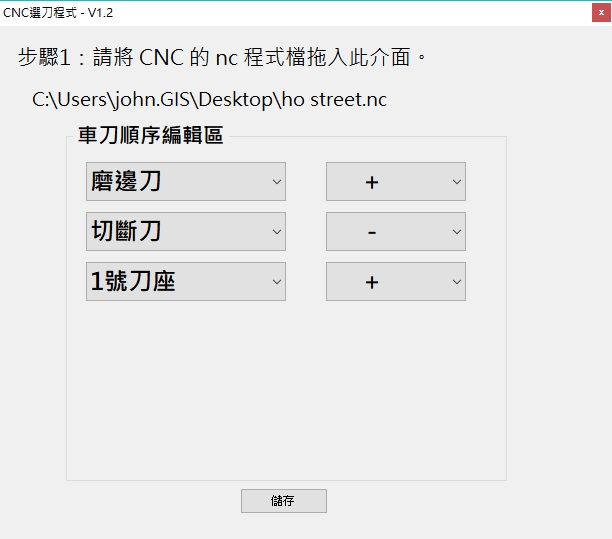

賴Q的 CNC 選刀小程式

使用方法：
  把 nc 檔或 txt 檔拖拉進去，
  會自動依照 M6Tx 作出選擇器
  選完後儲存，就會寫回原本的檔案
  

ChangeLog:
* 2020-07-14 V1.2 *
M6T1 2 3 4 6，會將 G1 Z+、- 改成 G1 Z+
M6T5 會將 G1 Z+、- 改成 G1 Z- 

* 2019-10-31 V1.0 *
將 M6T? 變成可以下拉選擇

 
  
