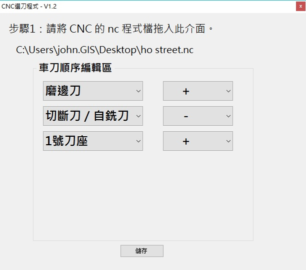

賴Q的 CNC 選刀小程式
 
使用方法： 
  把 nc 檔或 txt 檔拖拉進去， 
  會自動依照 M6Tx 作出選擇器 
  選完後儲存，就會寫回原本的檔案 
   
  針對 M6Tx x 為 12346 時，預設帶出 + 
  若 M6Tx x 為 5 時，預設帶出 - 
   
  該值會改變 G1 Z+ 或 G1 Z-
  

ChangeLog:
* 2020-07-14 V1.2 *
M6T1 2 3 4 6，會將 G1 Z+、- 改成 G1 Z+
M6T5 會將 G1 Z+、- 改成 G1 Z- 

* 2019-10-31 V1.0 *
將 M6T? 變成可以下拉選擇

 
  
